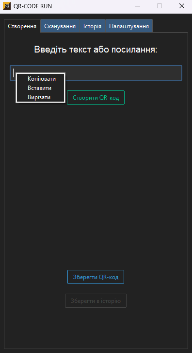

# 🚀 QR-CODE RUN

> Сучасна програма для створення, сканування та керування QR-кодами з історією, темами та зручним інтерфейсом.

---

## 🧩 Основні можливості

- ✅ Створення QR-кодів з будь-якого тексту або посилання
- 📷 Сканування QR-кодів з камери або зображення
- 🕓 Збереження історії створених та відсканованих кодів
- 🎨 Вибір світлої або темної теми оформлення
- 🖼️ Експорт QR-коду у форматах PNG, JPG
- 🧠 Інтелектуальна вставка тексту з буфера обміну
- 🧰 Простий та інтуїтивний інтерфейс на базі `ttkbootstrap`

---

## 🖼️ Інтерфейс

  

---

## 🛠️ Технології

- `Python 3.10+`
- `tkinter + ttkbootstrap`
- `OpenCV` – для сканування з камери
- `Pillow` – для обробки зображень
- `qrcode` – генерація QR-кодів
- `ttkbootstrap` – сучасний UI-дизайн
